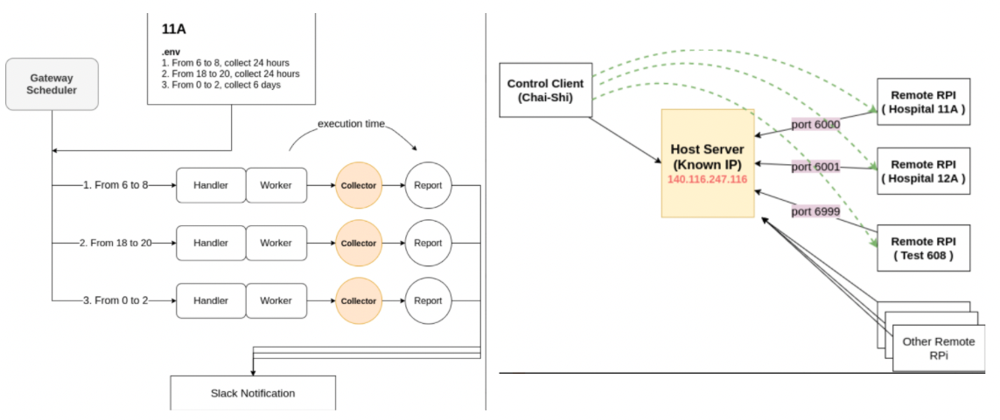
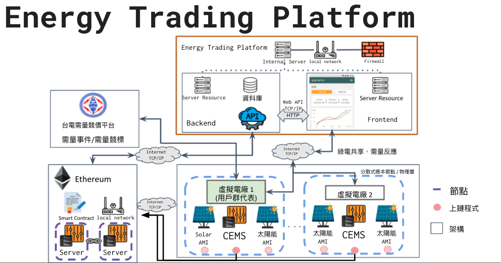
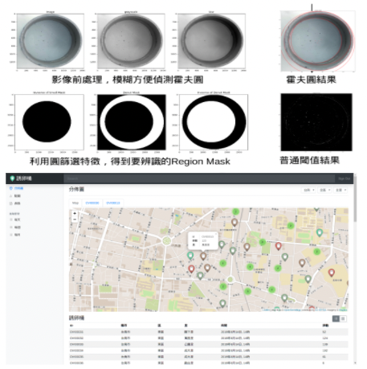
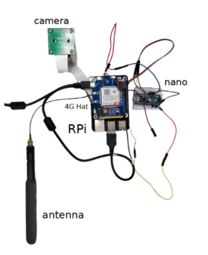
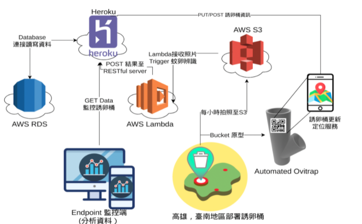

---
# Language (Optional)
lang: en
# Site Keywords & Description
keywords: Resume,Hexo,Resume Theme
description: MS CSIE Student at National Cheng Kung University
# Resume Title
resume_title: Chai Shi's Resume
# Job Applicant Name
name: Chang Chai Shi
avatar: images/avatar.jpg
# Contact
contact:
  # URL
  - icon: fas fa-globe-europe
    text: Github
    url: https://github.com/iknowright
  # Email
  - icon: fas fa-envelope
    text: changchaishi@gmail.com
    url: changchaishi@gmail.com

# PDF Download Link
# download:
#   title: Download
#   icon: fas fa-download fa-fw
#   url: https://github.com/iknowright
---

## <i class="fas fa-flag"></i> Summary

Fresh computer science postgraduate with strong hands-on experience in backend design, testing, linting, and provisioning. Equipped fundamental but diverse skill set such as mobile development, DevOps, IoT, and Blockchain. Passionate about software development and various technical skill.

## <i class="fas fa-user-graduate"></i> Education

**National Cheng Kung University**
BS Computer Science and Information Engineering - Sep 2016 ~ Jun 2020
MS Computer Science and Information Engineering - Sep 2020 ~ Present

## <i class="fas fa-user-tie"></i> Work Experience

#### Jul 2021 ~ Oct 2021 - NextDrive - Software Engineer Intern

- Development of heatstroke alert service integrated with corporate API
- Deployed backend and frontend using reverse proxy with SSL support
- Integrate CI/CD pipeline with gitlab ci and Ansible


<btns rounded>
<a href='https://fastapi.tiangolo.com/'>
  
  FastAPI
</a>
</btns> 


#### Mar 2020 ~ Mar 2021 - Nintingale AI - Research Assistant and Software Engineer

- Development of various Line chat bots with interactive user interface (Flex message, LIFF)
- Build BLE central gateways (RPi) for smart wrist data collection. Use Shellhub and docker to handle multiple devices orchestration and deployment
- Develop iOS and Android apps (Flutter) for smart wristband users. Handling Bluetooth events and use the DevOps pipeline (Gitlab-CI) for apps staging and publishing
- Setup blockchain private network (Ethereum geth) and built web explorer
- Research in a time-series algorithm for anomaly detection

#### AUG 2018 - Skymizer - Project Developer
- Implement ONNX library to help AI in edge devices
- Strengthen C language coding skills
- Master version control system (git) to collaborate with the team
- Improve problem solving skill
- Experience a day in life of a software engineer

## <i class="fas fa-award"></i> Featured Projects

### Smart Wrist Data Collection (iOS and Android)
- Use Flutter to implement multi-platform apps
- Use bluetooth to receive wristband data
- Integrate database and notification system
- Manage and publish the app


<btns rounded>
<a href='https://flutter.dev/'>
  
  Flutter
</a>
<a href='https://www.bluetooth.com/bluetooth-resources/intro-to-bluetooth-gap-gatt/'>
  
  BLE
</a>
</btns> 


<fancybox>

</fancybox>

### Smart Wristband Data Collection (Raspberry Pi)
- Use Raspberry Pi to receive BLE notification event
- Collect data and upload to private cloud
- Multiple IoT devices orchestration via Shellhub
- Integrated with CI/CD pipeline (Docker)

<btns rounded>
<a href='https://docs.gitlab.com/ee/ci/'>
  
  Gitlab CI
</a>
<a href='https://www.raspberrypi.org/'>
  
  Raspberry Pi
</a>
<a href='https://www.docker.com/'>
  
  Docker
</a>
<a href='https://github.com/shellhub-io'>
  
  Shellhub
</a>
</btns> 


<fancybox>

</fancybox>

### Energy Trading Platform
- Backend development of green energy trading system for BEMS (Building Electric Management System)
- Implement Ethereum Smart Contract to store trading transactions
- Building Ethereum private chain using POA


<btns rounded>
<a href='https://ethereum.org/en/'>
  
  Ethereum
</a>
<a href='https://flask.palletsprojects.com/en/2.0.x/'>
  
  Flask
</a>
</btns> 


<fancybox>

</fancybox>

### Automated Ovitrap System
- Implement mosquito larvae counting automation system using IoT devices
- Leverage serverless cloud computing for event-driven jobs
- Build both frontend and backend of information system
- Addon tools to improve user experience


<btns rounded>
<a href='https://aws.amazon.com/'>
  
  AWS
</a>
<a href='https://www.djangoproject.com/'>
  
  django
</a>
</btns> 


<fancybox>

</fancybox>

## <i class="fas fa-certificate"></i> Certification
- AWS Certified Cloud Practitioner
- AWS Certified Solution Architect - Associate





---
`Last Modified: 2021/11/11`
